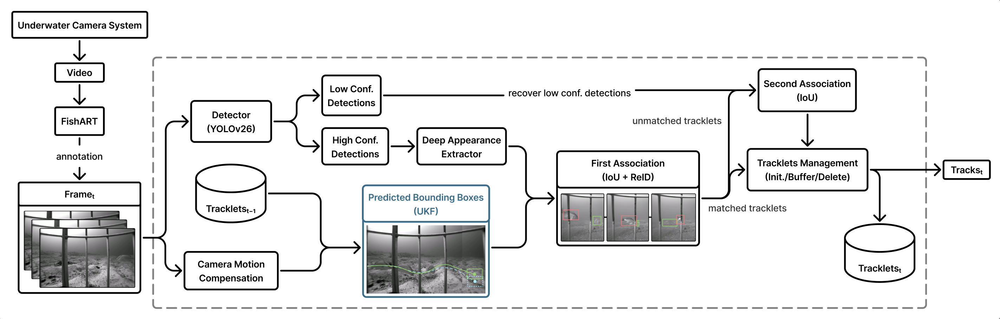
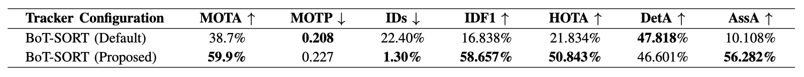
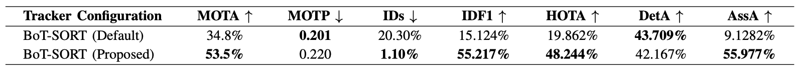

# GFISHERD24-UKF

This repository contains the code used to train and evaluate the detection and tracking models presented in the paper **"Improving Multi-Fish Tracking in Underwater Environments Using BoT-SORT Under Non-Linear Motion."**

The proposed tracking method modifies BoT-SORT by replacing its standard Kalman filter with an Unscented Kalman Filter (UKF) that incorporates nonlinear velocity damping.

The experiments use the GFISHERD24 dataset, YOLOv26-L detectors, and a modified BoT-SORT tracker to evaluate single- and multi-class fish tracking.

## Pipeline



The proposed pipeline consists of:

1. Preparing GFISHERD24 data for YOLO training
2. Training YOLOv26-L detectors
3. Tracking fish using BoT-SORT with the UKF motion model
4. Converting and filtering tracking results
5. Evaluating tracking performance using MOTMetrics and TrackEval

## Requirements

The experiments were run with Python 3.10.20.

The experiments used a locally modified Ultralytics checkout reporting version `8.4.117`, based on the following upstream commit:

```text
a343ddd8d56768db7911d363a2583bf97597c797
```

Create and activate a Python environment:

```bash
conda create --name gfisherd24-ukf python=3.10
conda activate gfisherd24-ukf
```

Clone the Ultralytics repository and check out the version used as the base for the experiments:

```bash
git clone https://github.com/ultralytics/ultralytics.git
cd ultralytics
git checkout a343ddd8d56768db7911d363a2583bf97597c797
pip install -e .
cd ..
```

Install the remaining requirements:

```bash
pip install -r requirements.txt
```

The experiments were run on GPU hardware. If needed, install a PyTorch build compatible with your system's CUDA environment.

### Modified BoT-SORT

The UKF tracking method modifies the BoT-SORT implementation included with Ultralytics by replacing its standard Kalman filter motion model with the UKF.

The modified files are provided in:

```text
src/ultralytics_mods/
└── trackers/
    ├── utils/
    │   └── ukf.py
    └── bot_sort.py
```

Copy these files into the corresponding locations in the Ultralytics repository:

```bash
cp src/ultralytics_mods/trackers/bot_sort.py /path/to/ultralytics/ultralytics/trackers/bot_sort.py
cp src/ultralytics_mods/trackers/utils/ukf.py /path/to/ultralytics/ultralytics/trackers/utils/ukf.py
```

## Setting Up GFISHERD24

GFISHERD24 contains more than 155 fish species and was used for detector training and tracking evaluation. The multi-class detector was trained using 155 classes.

The experiments used a 75:15:10 train/validation/test split.

The GFISHERD24 source videos and annotation files are publicly available. Links to these resources are provided in [`data/README.md`](data/README.md).

Detector training used a separately prepared collection of extracted image frames and corresponding annotations from GFISHERD24. The exact image collection and preprocessing steps used in the experiments are not included in this repository.

Two dataset configurations are provided:

```text
configs/GFISHERD24_single.yaml
configs/GFISHERD24_multi.yaml
```

Users working with their own prepared version of GFISHERD24 can update the `path` field in the appropriate configuration file to point to their local dataset.

Additional information about the data used for detector training, tracking, and evaluation is provided in [`data/README.md`](data/README.md).

## Training

Two YOLOv26-L detectors were trained for 75 epochs:

- Single-class, with all fish assigned to one `Fish` class
- Multi-class, using 155 fish classes

Both detectors were trained starting from the Ultralytics `yolo26l.pt` pretrained checkpoint.

Train the single-class detector:

```bash
python src/train/train.py \
  --data configs/GFISHERD24_single.yaml
```

Train the multi-class detector:

```bash
python src/train/train.py \
  --data configs/GFISHERD24_multi.yaml
```

The `best.pt` checkpoint from each training run was used for tracking and evaluation.

The `yolo26l.pt` pretrained checkpoint is downloaded automatically if it is not already available. The Ultralytics pretrained weights are not included in this repository. See the [Ultralytics YOLO26 documentation](https://docs.ultralytics.com/models/yolo26/) for information about the official pretrained models.

## Model Weights

The trained detector weights used in the paper are not included in this repository.

Users can train single- and multi-class detector checkpoints using the training procedure above. The resulting checkpoints can be organized as:

```text
weights/
├── single_class/
│   └── best.pt
└── multi_class/
    └── best.pt
```

See [`weights/README.md`](weights/README.md) for additional information about pretrained and trained detector checkpoints.

## Tracking

Tracking was performed using BoT-SORT with the UKF motion model. The tracker configuration used for the experiments is provided in [`configs/custom_botsort.yaml`](configs/custom_botsort.yaml).

The tracking script expects prepared test image sequences, with the frames for each sequence stored in an `img1/` directory, as described in [`data/README.md`](data/README.md).

Run the single-class tracker:

```bash
python src/track/track_dataset.py \
  --model weights/single_class/best.pt \
  --data-root /path/to/mot/test \
  --output runs/tracking_single
```

Run the multi-class tracker:

```bash
python src/track/track_dataset.py \
  --model weights/multi_class/best.pt \
  --data-root /path/to/mot/test \
  --output runs/tracking_multi
```

A detection confidence threshold of `0.3` was used for tracking.

## Evaluation

The evaluation pipeline is:

```text
track_dataset.py
      ↓
convert_to_mot.py
      ↓
filter_small_boxes.py
      ↓
prepare_evaluation.py
      ↓
evaluate.py
```

The tracking predictions are converted to MOT-format result files and evaluated against the separately prepared MOT ground truth.

### Convert Tracking Results to MOT Format

For the single-class results:

```bash
python src/evaluate/convert_to_mot.py \
  --track-root runs/tracking_single \
  --dataset-root /path/to/mot/test \
  --output runs/mot_single
```

For the multi-class results:

```bash
python src/evaluate/convert_to_mot.py \
  --track-root runs/tracking_multi \
  --dataset-root /path/to/mot/test \
  --output runs/mot_multi
```

### Filter Small Bounding Boxes

Bounding boxes with width × height below 800 are removed before evaluation.

For the single-class results:

```bash
python src/evaluate/filter_small_boxes.py \
  --input runs/mot_single \
  --output runs/mot_filtered_single
```

For the multi-class results:

```bash
python src/evaluate/filter_small_boxes.py \
  --input runs/mot_multi \
  --output runs/mot_filtered_multi
```

### Prepare Evaluation Files

Prepare the single-class results:

```bash
python src/evaluate/prepare_evaluation.py \
  --input runs/mot_filtered_single \
  --gt-root /path/to/mot/test \
  --output runs/evaluation_single
```

Prepare the multi-class results:

```bash
python src/evaluate/prepare_evaluation.py \
  --input runs/mot_filtered_multi \
  --gt-root /path/to/mot/test \
  --output runs/evaluation_multi
```

### TrackEval

Tracking performance is evaluated using both MOTMetrics and TrackEval.

Clone TrackEval separately before running the evaluation:

```bash
git clone https://github.com/JonathonLuiten/TrackEval.git
```

Pass the path to this directory to `evaluate.py` using `--trackeval-root`.

### Run Evaluation

For the single-class results:

```bash
python src/evaluate/evaluate.py \
  --gt-root /path/to/mot/test \
  --evaluation-root runs/evaluation_single \
  --trackeval-root /path/to/TrackEval
```

For the multi-class results:

```bash
python src/evaluate/evaluate.py \
  --gt-root /path/to/mot/test \
  --evaluation-root runs/evaluation_multi \
  --trackeval-root /path/to/TrackEval
```

The experiments were evaluated on 45 test sequences.

## Results

Results for the default BoT-SORT tracker and BoT-SORT with the nonlinear UKF motion model are provided in:

```text
results/
├── multi_class/
│   ├── default.txt
│   └── proposed.txt
└── single_class/
    ├── default.txt
    └── proposed.txt
```

### Single-Class Results



### Multi-Class Results



## Repository Structure

```text
GFISHERD24-UKF/
├── assets/
│   ├── multi_class_results.png
│   ├── pipeline.png
│   └── single_class_results.png
├── configs/
│   ├── GFISHERD24_multi.yaml
│   ├── GFISHERD24_single.yaml
│   └── custom_botsort.yaml
├── data/
│   └── README.md
├── results/
│   ├── multi_class/
│   │   ├── default.txt
│   │   └── proposed.txt
│   └── single_class/
│       ├── default.txt
│       └── proposed.txt
├── src/
│   ├── evaluate/
│   │   ├── convert_to_mot.py
│   │   ├── evaluate.py
│   │   ├── filter_small_boxes.py
│   │   └── prepare_evaluation.py
│   ├── track/
│   │   └── track_dataset.py
│   ├── train/
│   │   └── train.py
│   └── ultralytics_mods/
│       └── trackers/
│           ├── utils/
│           │   └── ukf.py
│           └── bot_sort.py
├── weights/
│   └── README.md
├── CITATION.cff
├── README.md
└── requirements.txt
```

## Citation

If you find this repository or the tracking method useful, the associated paper can be cited as:

```text
Amanda Lan, M M Nabi, Iffat Era Ebu, Jack Prior, and Robert Moorhead,
"Improving Multi-Fish Tracking in Underwater Environments Using BoT-SORT
Under Non-Linear Motion," to appear in the Proceedings of the IEEE/MTS
OCEANS 2026 Monterey Conference.
```

The citation will be updated with the final publication information when available.

## Acknowledgments and References

This work builds on the following software and research:

- **Ultralytics YOLO26 and BoT-SORT implementation**

  - Glenn Jocher, Jing Qiu, Mengyu Liu, Shuai Lyu, Fatih Cagatay Akyon, and Muhammet Esat Kalfaoglu, "Ultralytics YOLO26: Unified Real-Time End-to-End Vision Models," 2026.
  - [Paper](https://arxiv.org/abs/2606.03748) | [Ultralytics repository](https://github.com/ultralytics/ultralytics) | [YOLO26 documentation](https://docs.ultralytics.com/models/yolo26/)

- **BoT-SORT**

  - Nir Aharon, Roy Orfaig, and Ben-Zion Bobrovsky, "BoT-SORT: Robust Associations Multi-Pedestrian Tracking," 2022.
  - [Paper](https://arxiv.org/abs/2206.14651) | [Repository](https://github.com/NirAharon/BoT-SORT)

- **MOTMetrics**

  - [MOTMetrics repository](https://github.com/cheind/py-motmetrics)

- **TrackEval and HOTA**

  - Jonathon Luiten et al., "HOTA: A Higher Order Metric for Evaluating Multi-Object Tracking," 2020.
  - [Paper](https://arxiv.org/abs/2009.07736) | [TrackEval repository](https://github.com/JonathonLuiten/TrackEval)

The files in `src/ultralytics_mods/` are modified from Ultralytics source code, retain the upstream Ultralytics AGPL-3.0 license, and include modification notices.
